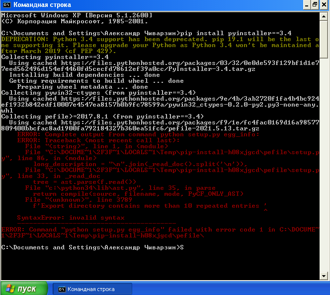
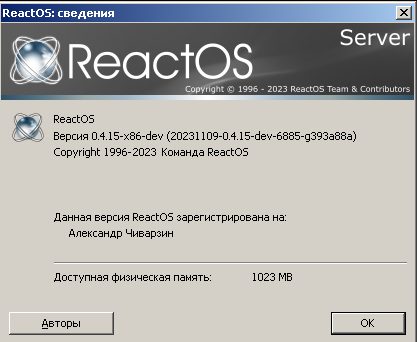
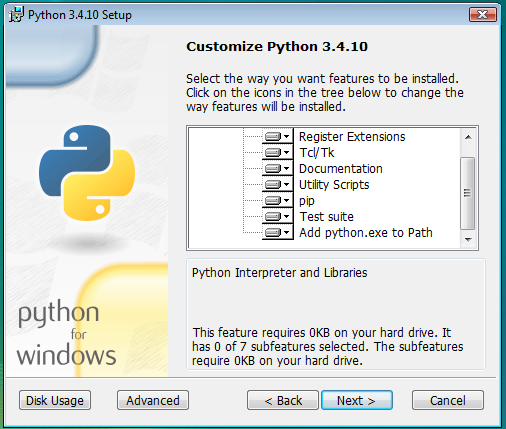
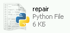
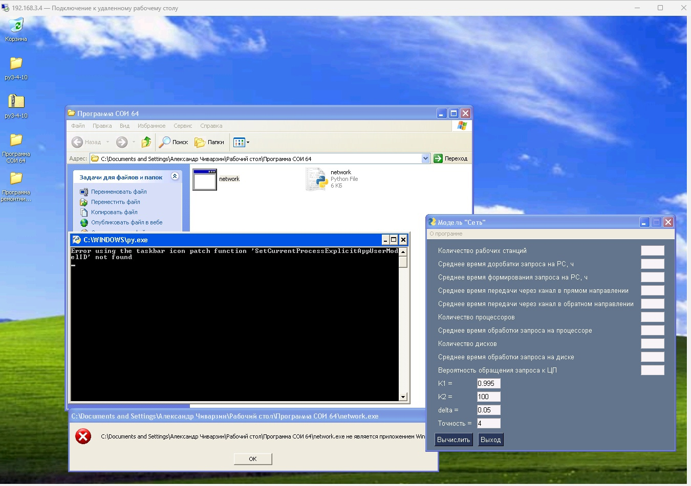
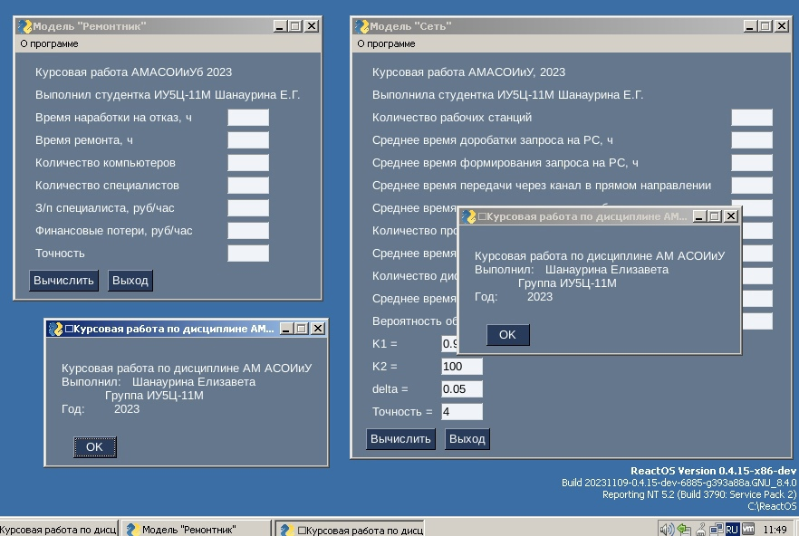

# Сборка Python приложений под Microsoft Windows XP

Работоспособность программы под Windows XP x86 является критерием, необходимым для зачёта по курсовой работе АМ АСОИиУ.

# Требования к программе / скрипту

1. Программа должна запускаться на Python 3.4.10 x86 под Windows XP x86
2. Программа должна быть представлена в виде EXE, способного выполняться при отсутствии интерпритатора в ОС.

# Для сборки и проверки понадобится

1. [Windovs Vista x86](https://download-original-windows.ru/msdn-windows/windows-vista/)
2. Python 3.4.10 ==> [Первоисточник](http://matejhorvat.si/en/windows/python/index.htm) | [Web Archive](https://web.archive.org/web/20231108142652/http://matejhorvat.si/en/windows/python/index.htm) | [Яндекс. диск](https://disk.yandex.ru/d/T2WmRKIMiGidXA)
3. [Windows XP SP3 x86](https://download-original-windows.ru/msdn-windows/windows-xp/) (в крайнем случае можно воспользоваться [ReactOS](https://reactos.org/) 0.4.15 x86)

<details>
<summary>Зачем Windows Vista, если нужно собрать под XP?</summary>

После долгих неудачных попыток установить pyinstaller в Windows XP я нашёл такое <a href="https://stackoverflow.com/questions/14289979/convert-python-script-to-exe-that-will-work-on-all-most-versions-of-windows">решение</a>.<br>

Если пытаться установить на Windows XP, то будет примерно так...<br>

<br>

</details>

<details>
<summary>Для желающих тестировать на ReactOS</summary>

<br>

ReactOS - это открытая реализация NT 5.2 (Windows XP / Server 2003), имеющая кучу багов.
Не надо думать, что, если при закрытии программы ROS упадёт в BSOD, то XP сделает также.

Поэтому - не забывайте делать снимки состояния ВМ!!!

</details>

# Подготовка к установке Python

1. Установить гипервизор (VirtualBox / VMware / Hyper-V / QEMU / ...)
2. Создать ВМ (лучше использовать линамический жёсткий диск. В этом случае размер можно ставить побольше и наугад)<br>
    При выборе характеристик смотреть требования к Windows Vista.
3. Подключить к ВМ образ ОС. (Windows XP Professional VL, Windows Vista Enterprise)
4. При установке ввести ключ:
    * Для XP - см. скачанные файлы
    * Для Vista `VKK3X-68KWM-X2YGT-QR4M6-4BWMV` (Пока идёт установка гуглим про on-line KMS...)
5. Установить обновления на ОС

# Установка Python

1. Распаковать архив
2. Установить библиотеку `vcredist_x86.exe`
3. Запустить установщик python
4. Выбрать такие параметры установки<br>
    
5. Обновить `pip` запуском `get-pip.py` (не пытаться обновлять имеющимся "из коробки" pip до актуальной версии!)

После этого файлы .py начнут правильно определяться Windows:



# Установка пакетов

Рассмотрим 2 случая:
1. Для проверки и запуска на Windows XP (как `.py` файл)
2. Для сборки EXE под XP на Windows Vista.

В обоих случаях рассмотрим минимальную конфигурацию (только pySimpleGUI без графиков)

## 1. Для Windows XP

1. Открыть командную строку (`CMD`).
2. Ввести команду `pip install pysimplegui==4.60.5` (нажать Enter для её выполнения)

После этого примитивные программы (без суперсложной логики и графиков) будут запускаться по двойному клику.

## 2. Для сборки EXE на Windows Vista

1. Скопировать этот текст и сохранить как `requirements.txt`

```
altgraph==0.17.4
future==0.18.3
macholib==1.16.3
pefile==2017.9.3
PyInstaller==3.4
PySimpleGUI==4.60.5
pywin32-ctypes==0.2.0
setuptools==28.8.0
typing==3.10.0.0
```

2. Открыть `CMD`
3. Перейти в каталог с файлом `requirements.txt` (Например, `cd C:\1`)
4. Выполнить команду `pip install -r requirements.txt`
5. Перейти в каталог с `py` файлом, который надо преобразовать в EXE
6. Ввести команду

```
pyinstaller --noconsole --onefile changeME.py
```

Где `changeME.py` - имя Python программы.

7. Проверить работоспособность EXE.

# Пример работающей программы

<details>
<summary>Windows XP через интерпритатор</summary>


<br>
Ошибка на скриншоте показывает, что будет, если запустить на XP EXE созданный на Windows 11.

</details>

<details>
<summary>ReactOS без интерпритатора</summary>
Работоспособность того же EXE также проверялась на XP<br>



</details>