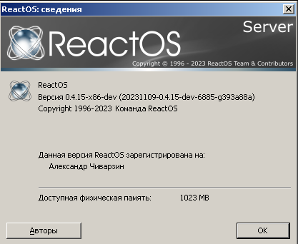

# Сборка Python приложений под Microsoft Windows XP

Работоспособность программы под Windows XP x86 является критерием, необходимым для зачёта по курсовой работе АМ АСОИиУ.

# Требования к программе / скрипту

1. Программа должна запускаться на Python 3.4.10 x86 под Windows XP x86
2. Программа должна быть представлена в виде EXE, способного выполняться при отсутствии интерпритатора в ОС.

# Для сборки и проверки понадобится

1. [Windovs Vista x86](https://download-original-windows.ru/msdn-windows/windows-vista/)
2. Python 3.4.10 ==> [Первоисточник](http://matejhorvat.si/en/windows/python/index.htm) | [Web Archive](https://web.archive.org/web/20231108142652/http://matejhorvat.si/en/windows/python/index.htm) | [Яндекс. диск](https://disk.yandex.ru/d/T2WmRKIMiGidXA)
3. [Windows XP SP3 x86] (в крайнем случае можно воспользоваться [ReactOS](https://reactos.org/) 0.4.15 x86)

Зачем Windows Vista, если нужно собрать под XP?

После долгих неудачных попыток установить pyinstaller в Windows XP я нашёл такое <a href="https://stackoverflow.com/questions/14289979/convert-python-script-to-exe-that-will-work-on-all-most-versions-of-windows">решение</a>.

Для желающих тестировать на ReactOS

ReactOS - это открытая реализация NT 5.2 (Windows XP / Server 2003), имеющая кучу багов.
Не надо думать, что, если при закрытии программы ROS упадёт в BSOD, то XP сделает также.

Поэтому - не забывайте делать снимки состояния ВМ!!!

# Подготовка к установке Python

1. Установить гипервизор (VirtualBox / VMware / Hyper-V / QEMU / ...)
2. Создать ВМ (лучше использовать линамический жёсткий диск. В этом случае размер можно ставить побольше и наугад) 
    При выборе характеристик смотреть требования к Windows Vista.
3. Подключить к ВМ образ ОС. (Windows XP Professional VL, Windows Vista Enterprise)
4. При установке ввести ключ:
    * Для XP - см. скачанные файлы
    * Для Vista `VKK3X-68KWM-X2YGT-QR4M6-4BWMV` (Пока идёт установка гуглим про on-line KMS...)
5. Установить обновления на ОС

# Установка Python

1. Распаковать архив
2. Установить библиотеку `vcredist_x86.exe`
3. Запустить установщик python
4. Выбрать такие параметры установки
    
5. Обновить `pip` запуском `get-pip.py` (не пытаться обновлять имеющимся "из коробки" pip до актуальной версии!)